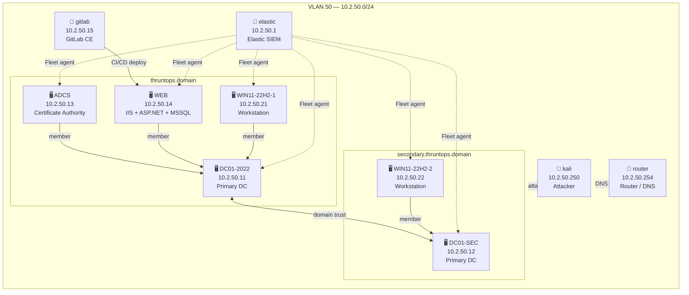

# ThruntOps

A Ludus-based lab environment for TTP testing and security research.

## Purpose

ThruntOps exists to provide a controlled environment for testing attack techniques and procedures (TTPs). The design philosophy is breadth over depth: rather than optimizing for a single attack scenario, the lab grows by adding technologies — each one introducing new attack surfaces, protocols, and vectors to test against.

## Architecture

Deployed on Proxmox via [Ludus](https://docs.ludus.cloud). All VMs run on VLAN 50 (`10.2.50.0/24`).

| IP | Hostname | OS | Role |
|---|---|---|---|
| 10.2.50.1 | elastic | Debian 12 | SIEM — Elastic Stack + Fleet |
| 10.2.50.11 | DC01-2022 | Windows Server 2022 | Primary DC — `thruntops.domain` |
| 10.2.50.12 | DC01-SEC | Windows Server 2022 | Primary DC — `secondary.thruntops.domain` |
| 10.2.50.13 | ADCS | Windows Server 2022 | Certificate Authority — `thruntops.domain` |
| 10.2.50.14 | WEB | Windows Server 2022 | IIS + ASP.NET + MSSQL 2019 |
| 10.2.50.15 | gitlab | Ubuntu 24.04 | GitLab CE — source control + CI/CD |
| 10.2.50.21 | WIN11-22H2-1 | Windows 11 22H2 | Workstation — `thruntops.domain` |
| 10.2.50.22 | WIN11-22H2-2 | Windows 11 22H2 | Workstation — `secondary.thruntops.domain` |
| 10.2.50.250 | kali | Kali Linux | Attacker |
| 10.2.50.254 | router | Debian 11 | Router / DNS |

## Network Diagram

## Users

See the [Users reference](https://enonethreezed.github.io/ThruntOps/users) for the full credentials reference.

## Development Pipeline

GitLab CE (`10.2.50.15`) is the source control and CI/CD hub for the web application running on WEB (`10.2.50.14`). Code pushed to GitLab triggers a pipeline that deploys to `C:\inetpub\wwwroot` on the IIS server.

## Attack Surface

See the [Vulnerabilities reference](https://enonethreezed.github.io/ThruntOps/vulnerabilities) for the full attack surface reference.

## Installation

See the [Installation guide](https://enonethreezed.github.io/ThruntOps/install) for full setup instructions.

## Roadmap

- Vulnerable web application covering OWASP Top 10
- GitLab CI/CD pipeline to WEB (automated deploy on push)
- Sigma rules + Atomic Red Team detection pipeline — see [proposal](https://enonethreezed.github.io/ThruntOps/sigma)
- Atomic Red Team on workstations (WIN11-22H2-1, WIN11-22H2-2)
- BAS (Breach and Attack Simulation) integration — cross-platform Linux + Windows coverage
- Reduce resource requirements to support lower-spec hosts (target: 32 GB RAM)
