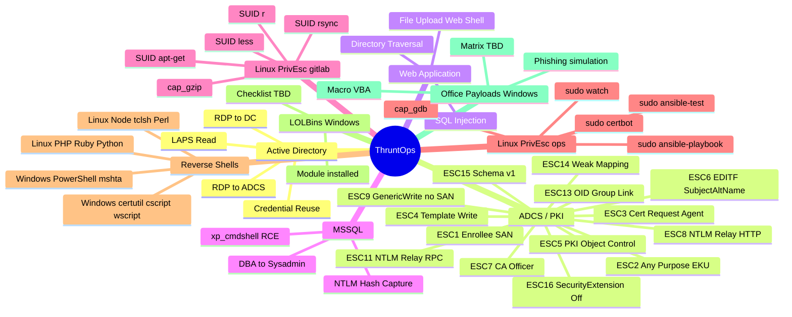

# Lab Coverage
{: .no_toc }

All attack techniques, vulnerability classes, and test scenarios available in ThruntOps.
{: .fs-6 .fw-300 }

---

---

## Summary

| Category | Techniques | VM | Docs |
|---|---|---|---|
| **Active Directory** | Credential reuse, RDP to DC, LAPS read, RDP to ADCS | DC01-2022, DC01-SEC, WIN11 | [Vulnerabilities](vulnerabilities.md) |
| **ADCS / PKI** | ESC1–ESC16 | ADCS (10.2.50.13) | [ADCS Attack Paths](adcs.md) |
| **Web Application** | SQL injection, file upload, directory traversal | WEB (10.2.50.14) | [Vulnerabilities](vulnerabilities.md) |
| **MSSQL** | xp_cmdshell, NTLM capture, DBA→sysadmin | WEB (10.2.50.14) | [Vulnerabilities](vulnerabilities.md) |
| **Linux PrivEsc — gitlab** | SUID (r, apt-get, less, rsync), cap_gzip | gitlab (10.2.50.15) | [Vulnerabilities](vulnerabilities.md) |
| **Linux PrivEsc — ops** | sudo (ansible-playbook, ansible-test, certbot, watch), cap_gdb | ops (10.2.50.2) | [Vulnerabilities](vulnerabilities.md) |
| **Reverse Shells — Linux** | PHP, Ruby, Python, Node.js, tclsh, Perl | ops, gitlab | [Vulnerabilities](vulnerabilities.md) |
| **Reverse Shells — Windows** | PowerShell, mshta, certutil, cscript, wscript | WEB, WIN11 | [Vulnerabilities](vulnerabilities.md) |
| **LOLBins — Windows** | Module installed for user08 on WIN11-22H2-1/2 | WIN11-22H2-1/2 | — |
| **Office Payloads — Windows** | Macro/VBA execution, phishing simulation — Office 2019 installed on workstations. Full test matrix TBD. | WIN11-22H2-1/2 | — |

---

## ADCS Quick Reference

| ESC | Condition | Entry Point |
|---|---|---|
| ESC1 | Enrollee supplies SAN + Client Auth EKU | `domainuser` |
| ESC2 | Any Purpose EKU | `domainuser` |
| ESC3 | Certificate Request Agent EKU | `domainuser` |
| ESC4 | Write permission on template | `domainuser` |
| ESC5 | Control of PKI AD object | `esc5user` |
| ESC6 | EDITF_ATTRIBUTESUBJECTALTNAME2 on CA | `domainuser` |
| ESC7 | ManageCA / ManageCertificates | `esc7_camgr_user`, `esc7_certmgr_user` |
| ESC8 | NTLM relay → ADCS HTTP enrollment | PetitPotam coercion |
| ESC9 | GenericWrite on victim + no SAN security | `domainuser` → `esc9user` |
| ESC11 | NTLM relay → ADCS RPC (ICertPassage) | PetitPotam coercion |
| ESC13 | OID group link escalation | `esc13user` |
| ESC14 | Weak explicit mapping | `domainuser` |
| ESC15 | Schema version 1 SAN bypass | `domainuser` |
| ESC16 | GenericWrite → SecurityExtension disabled | `domainuser` → `esc16user` |

---

## Linux PrivEsc Quick Reference

| Technique | VM | Entry | Target |
|---|---|---|---|
| SUID r | gitlab | `secondary_user06` (no sudo) | root shell |
| SUID apt-get | gitlab | `secondary_user06` | root shell |
| SUID less | gitlab | `secondary_user06` | root shell |
| SUID rsync | gitlab | `secondary_user06` | root shell |
| cap_gzip | gitlab | `secondary_user06` | arbitrary file read |
| sudo ansible-playbook | ops | `primary_user06` (no sudo on most) | root shell |
| sudo ansible-test | ops | `primary_user06` | root shell |
| sudo certbot | ops | `primary_user06` | root shell |
| sudo watch | ops | `primary_user06` | root shell |
| cap_gdb | ops | `primary_user06` | root shell (CAP_SETUID) |
