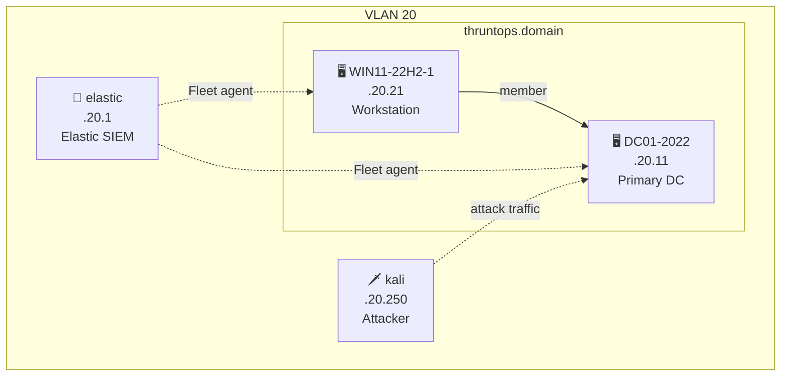

# Elastic Backend
{: .no_toc }

Elastic Stack SIEM with a single 2022 AD domain, a Windows 11 workstation, and a Kali attacker VM.
{: .fs-6 .fw_300 }

---

## Table of contents
{: .no_toc .text-delta }

1. TOC
{:toc}

---

## Infrastructure

All VMs run on VLAN 20.

| IP | Hostname | OS | Role |
|---|---|---|---|
| .20.1 | elastic | Debian 12 | SIEM — Elastic Stack + Fleet |
| .20.11 | DC01-2022 | Windows Server 2022 | Primary DC — `thruntops.domain` |
| .20.21 | WIN11-22H2-1 | Windows 11 22H2 | Workstation — `thruntops.domain` |
| .20.250 | kali | Kali Linux | Attacker box |

> IP prefix depends on the Ludus range network (e.g. `10.1.0.0/16` → `10.1.20.x`).

---

## Network Diagram



---

## Credentials

| Service | URL | User | Password |
|---|---|---|---|
| Elastic / Kibana | `https://<range_ip>.20.1:5601` | `elastic` | `thisisapassword` (set in `ranges/elk-base-2022.yml`) |

Domain and local accounts use Ludus defaults — see [Users](users.md).

---

## Deployment

```bash
./siem.sh deploy elastic   # ranges/elk-base-2022.yml
```

Or step by step:

```bash
ludus range destroy
ludus range config set -f ranges/elk-base-2022.yml
ludus range deploy
ludus range logs -f
```

---

## Verify

```bash
./siem.sh check elastic
./siem.sh status elastic
```

Or manually, confirm all agents enrolled in Fleet:

**Kibana → Management → Fleet → Agents**

Both Windows VMs (`DC01-2022`, `WIN11-22H2-1`) should show status `Healthy`.

Check range status:

```bash
ludus range status
```

---

## Notes

- `elk-base-2022.yml` deploys Elastic Stack version `9.4.0`
- Elastic Agent is pinned to `9.4.0` via `ludus_elastic_agent_version` (role_vars on each Windows VM) to match the stack version
