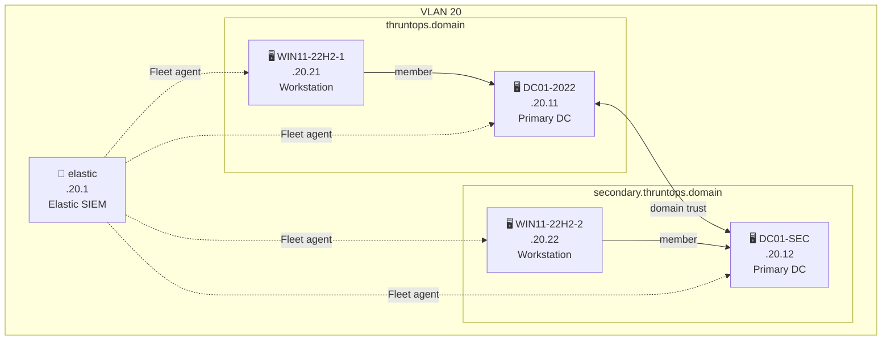

# Elastic Profile
{: .no_toc }

Elastic Stack SIEM with dual AD domains and workstations. Fase 1 — core infrastructure and agent enrollment.
{: .fs-6 .fw-300 }

Validated on Ludus 2 across all three profiles (`--base`, `--dual`, `--adcs`): a from-scratch deploy (destroy + deploy) succeeds, domain authentication works, Kibana/Fleet is reachable, and every endpoint enrolls.
{: .label .label-green }

---

## Table of contents
{: .no_toc .text-delta }

1. TOC
{:toc}

---

## Infrastructure

All VMs run on VLAN 20.

| IP | Hostname | OS | Role |
|---|---|---|---|
| .20.1 | elastic | Debian 12 | SIEM — Elastic Stack + Fleet |
| .20.11 | DC01-2022 | Windows Server 2022 | Primary DC — `thruntops.domain` |
| .20.12 | DC01-SEC | Windows Server 2022 | Primary DC — `secondary.thruntops.domain` |
| .20.21 | WIN11-22H2-1 | Windows 11 22H2 | Workstation — `thruntops.domain` |
| .20.22 | WIN11-22H2-2 | Windows 11 22H2 | Workstation — `secondary.thruntops.domain` |

> IP prefix depends on the Ludus range network (e.g. `10.1.0.0/16` → `10.1.20.x`).

Table shows `--dual` (5 VMs). `--base` drops the secondary domain (3 VMs: `elastic`, `DC01-2022`, `WIN11-22H2-1`). `--adcs` swaps the secondary domain for a dedicated ADCS VM at `.20.13` (4 VMs: `elastic`, `DC01-2022`, `ADCS`, `WIN11-22H2-1`) — single domain only.

---

## Network Diagram



---

## Credentials

| Service | URL | User | Password |
|---|---|---|---|
| Elastic / Kibana | `https://<range_ip>.20.1:5601` | `elastic` | set in `elk-dual.yml` → `ludus_elastic_password` |

### Local & Domain — Ludus defaults

| User | Password | Scope |
|---|---|---|
| `localuser` | `password` (template default) | Local Admin (Windows) / SSH login (Linux) — all VMs |
| `THRUNTOPS\domainadmin` | `password` | Domain Admin — thruntops.domain |
| `THRUNTOPS\domainuser` | `password` | Domain User — thruntops.domain |
| `SECONDARY\domainadmin` | `password` | Domain Admin — secondary.thruntops.domain |
| `SECONDARY\domainuser` | `password` | Domain User — secondary.thruntops.domain |

---

## Deployment

```bash
bash elastic.sh --dual   # 2 AD + 2 workstations
bash elastic.sh --base   # 1 AD + 1 workstation
bash elastic.sh --adcs   # 1 AD + ADCS + 1 workstation
```

Or step by step:

```bash
ludus range destroy
ludus range config set -f ranges/elk-dual.yml
ludus range deploy
ludus range logs -f
```

---

## Verify

All three profiles have passed the post-deploy validation checklist on Ludus 2, run with the matching flag:

```bash
RANGE_PREFIX=10.<range> tests/elastic_checklist.sh --base   # or --dual / --adcs
```

Or manually, confirm all agents enrolled in Fleet:

**Kibana → Management → Fleet → Agents**

Every Windows VM in the deployed profile should show status `Healthy` (2 for `--base`, 4 for `--dual`, 3 for `--adcs`).

Check range status:

```bash
ludus range status
```

---

## Notes

- `elk-dual.yml` deploys Elastic Stack version `9.4.0` (also available as `elk-base.yml` and `elk-adcs.yml` — see `elastic.sh`)
- Elastic Agent is pinned to `9.4.0` via `ludus_elastic_agent_version` (role_vars on each Windows VM) to match the stack version — `badsectorlabs.ludus_elastic_agent` defaults to `9.3.1` otherwise
- Fase 2 will add ADCS, WEB (IIS + MSSQL), GitLab CE, and OPS VM.
