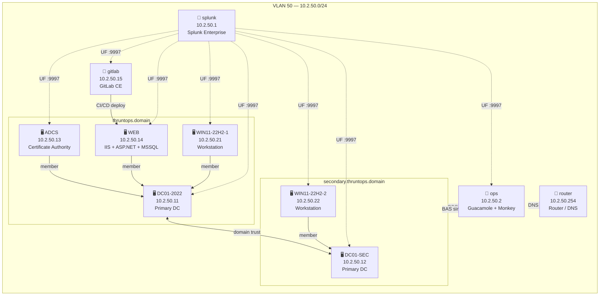

# Splunk Profile
{: .no_toc }

Full lab with Splunk Enterprise SIEM, dual AD domains, ADCS, IIS + MSSQL, GitLab CE, and Breach & Attack Simulation. Mirrors the Elastic profile with Universal Forwarders on all VMs.
{: .fs-6 .fw-300 }

---

## Table of contents
{: .no_toc .text-delta }

1. TOC
{:toc}

---

## Infrastructure

All VMs run on VLAN 50 (`10.2.50.0/24`).

| IP | Hostname | OS | Role |
|---|---|---|---|
| 10.2.50.1 | splunk | Ubuntu 24.04 | SIEM — Splunk Enterprise |
| 10.2.50.2 | ops | Ubuntu 24.04 | Operations — Guacamole + Infection Monkey |
| 10.2.50.11 | DC01-2022 | Windows Server 2022 | Primary DC — `thruntops.domain` |
| 10.2.50.12 | DC01-SEC | Windows Server 2022 | Primary DC — `secondary.thruntops.domain` |
| 10.2.50.13 | ADCS | Windows Server 2022 | Certificate Authority — `thruntops.domain` |
| 10.2.50.14 | WEB | Windows Server 2022 | IIS + ASP.NET + MSSQL 2019 |
| 10.2.50.15 | gitlab | Ubuntu 24.04 | GitLab CE — source control + CI/CD |
| 10.2.50.21 | WIN11-22H2-1 | Windows 11 22H2 | Workstation — `thruntops.domain` |
| 10.2.50.22 | WIN11-22H2-2 | Windows 11 22H2 | Workstation — `secondary.thruntops.domain` |
| 10.2.50.254 | router | Debian 11 | Router / DNS |

> Kali is not deployed by default. Run `bash scripts/add-kali.sh` to add it at `10.2.50.250`.

---

## Network Diagram



---

## Credentials

| Service | URL | User | Password |
|---|---|---|---|
| Splunk Web | `http://10.2.50.1:8000` | `admin` | set in `splunk.yml` → `ludus_splunk_admin_password` |
| Guacamole | `http://10.2.50.2:8080/guacamole/` | `guacadmin` | `guacadmin` |
| Infection Monkey | `https://10.2.50.2:5000` | — | set on first visit |
| GitLab | `http://10.2.50.15` | `root` | set on first visit |

### Guacamole pre-loaded connections

| Connection | Protocol | Host | Bound user | Password |
|---|---|---|---|---|
| DC01-2022 | RDP | 10.2.50.11 | `thruntops\domainuser` | `NV#8SL9#` |
| DC01-SEC | RDP | 10.2.50.12 | `secondary\domainuser` | `p0aAQ¿9)` |
| ADCS | RDP | 10.2.50.13 | `thruntops\primary_user04` | `ggA15$y!` |
| WEB | RDP | 10.2.50.14 | `webadmin` | `O5G=S(5q` |
| WIN11-22H2-1 | RDP | 10.2.50.21 | `basicuser` | `H)2?H8vC` |
| WIN11-22H2-2 | RDP | 10.2.50.22 | `basicuser` | `H)2?H8vC` |
| gitlab | SSH | 10.2.50.15 | `primary_user05` | `X¿s|m7C8` |
| SIEM | SSH | 10.2.50.1 | `localuser` | — (key auth) |
| ops | SSH | 10.2.50.2 | `localuser` | — (key auth) |

---

## Developer License

By default Splunk runs under the free license (500 MB/day ingest limit). To apply a developer license (50 GB/day):

1. Download your license from [dev.splunk.com](https://dev.splunk.com)
2. Place the file at the repo root as `Splunk.License` (already in `.gitignore`)
3. Copy it to the Ludus server:
   ```bash
   scp Splunk.License ludus-admin@<ludus-host>:~/
   ```
4. Uncomment and set `ludus_splunk_license_src` in `splunk.yml`:
   ```yaml
   ludus_splunk_license_src: "/home/ludus-admin/Splunk.License"
   ```

The role applies the license and restarts Splunk automatically during deploy.

---

## Deployment

### Install roles

```bash
# Splunk server
ludus ansible roles add -d roles/ludus_splunk

# Splunk Universal Forwarder (Windows + Linux)
ludus ansible roles add -d roles/ludus_splunk_uf

# ADCS, MSSQL, GitLab, local roles
ludus ansible roles add badsectorlabs.ludus_adcs
ludus ansible roles add badsectorlabs.ludus_mssql
ludus ansible roles add https://github.com/Cyblex-Consulting/ludus-local-users/archive/refs/heads/main.tar.gz
ludus ansible roles add https://github.com/Cyblex-Consulting/ludus-ad-content/archive/refs/heads/main.tar.gz
ludus ansible roles add -d roles/ludus_iis
curl -sL https://github.com/Cyblex-Consulting/ludus-gitlab-ce/archive/refs/heads/main.tar.gz -o /tmp/ludus-gitlab-ce.tar.gz
mkdir -p /tmp/ludus_gitlab_ce
tar -xzf /tmp/ludus-gitlab-ce.tar.gz -C /tmp/ludus_gitlab_ce --strip-components=1
sed -i 's/role_name: ludus_ad_content/role_name: ludus_gitlab_ce/' /tmp/ludus_gitlab_ce/meta/main.yml
ludus ansible roles add -d /tmp/ludus_gitlab_ce
ludus ansible roles add -d roles/ludus_ad_content
ludus ansible roles add -d roles/ludus_gitlab_ldap
ludus ansible roles add -d roles/ludus_laps
ludus ansible roles add -d roles/ludus_ops
ludus ansible roles add -d roles/ludus_sssd
ludus ansible roles add -d roles/ludus_privesc
ludus ansible roles add -d roles/ludus_atomic_red_team
```

See the [Installation guide](install.md) for full template and prerequisite setup.

### Deploy

```bash
ludus range config set -f ranges/splunk.yml
ludus range deploy
```

Monitor:

```bash
ludus range logs -f
```

### Verify

Check that all Universal Forwarders are connected and sending data via the Splunk Web UI at `http://10.2.50.1:8000`:

- **Settings → Forwarding and receiving → Forwarder management** — all agents should appear
- **Search:** `index=windows earliest=-15m` — should return Windows Event Log data from all domain-joined VMs
- **Search:** `index=sysmon earliest=-15m` — should return Sysmon events
- **Search:** `index=linux earliest=-15m` — should return syslog/auth.log from ops and gitlab

---

## Indexes

| Index | Source | Content |
|---|---|---|
| `windows` | All Windows VMs | Windows Event Logs (Application, Security, System, PowerShell) |
| `sysmon` | All Windows VMs | Microsoft-Windows-Sysmon/Operational |
| `linux` | ops, gitlab | syslog, auth.log, dpkg.log |
