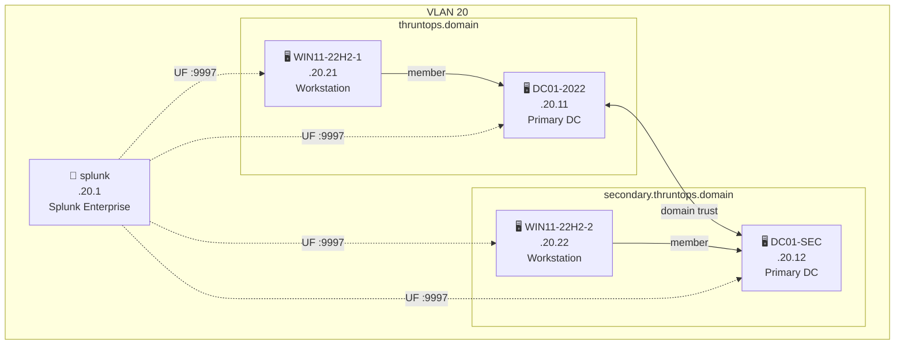

# Splunk Profile
{: .no_toc }

Splunk Enterprise SIEM with dual AD domains and workstations. Fase 1 — core infrastructure and agent enrollment.
{: .fs-6 .fw-300 }

Validated on Ludus 2: deploy succeeds, domain authentication works, Splunk is reachable, and all four Universal Forwarders report telemetry.
{: .label .label-green }

---

## Table of contents
{: .no_toc .text-delta }

1. TOC
{:toc}

---

## Infrastructure

All VMs run on VLAN 20.

| IP | Hostname | OS | Role |
|---|---|---|---|
| .20.1 | splunk | Ubuntu 24.04 | SIEM — Splunk Enterprise |
| .20.11 | DC01-2022 | Windows Server 2022 | Primary DC — `thruntops.domain` |
| .20.12 | DC01-SEC | Windows Server 2022 | Primary DC — `secondary.thruntops.domain` |
| .20.21 | WIN11-22H2-1 | Windows 11 22H2 | Workstation — `thruntops.domain` |
| .20.22 | WIN11-22H2-2 | Windows 11 22H2 | Workstation — `secondary.thruntops.domain` |

> IP prefix depends on the Ludus range network (e.g. `10.1.0.0/16` → `10.1.20.x`).

---

## Network Diagram


```mermaid
graph TB
    subgraph VLAN20["VLAN 20"]

        subgraph primary["thruntops.domain"]
            DC1["🖥 DC01-2022\n.20.11\nPrimary DC"]
            W1["🖥 WIN11-22H2-1\n.20.21\nWorkstation"]
        end

        subgraph secondary["secondary.thruntops.domain"]
            DC2["🖥 DC01-SEC\n.20.12\nPrimary DC"]
            W2["🖥 WIN11-22H2-2\n.20.22\nWorkstation"]
        end

        SPLUNK["🐧 splunk\n.20.1\nSplunk Enterprise"]
    end

    DC1 <-->|"domain trust"| DC2
    W1 -->|"member"| DC1
    W2 -->|"member"| DC2

    SPLUNK -.->|"UF :9997"| DC1
    SPLUNK -.->|"UF :9997"| DC2
    SPLUNK -.->|"UF :9997"| W1
    SPLUNK -.->|"UF :9997"| W2
```

---

## Credentials

| Service | URL | User | Password |
|---|---|---|---|
| Splunk Web | `http://<range_ip>.20.1:8000` | `admin` | set in `splunk-dual.yml` → `ludus_splunk_admin_password` |

### Windows — Ludus defaults

| User | Password | Scope |
|---|---|---|
| `localuser` | `password` (template default) | Local Admin — all Windows VMs |
| `THRUNTOPS\domainadmin` | `password` | Domain Admin — thruntops.domain |
| `THRUNTOPS\domainuser` | `password` | Domain User — thruntops.domain |
| `SECONDARY\domainadmin` | `password` | Domain Admin — secondary.thruntops.domain |
| `SECONDARY\domainuser` | `password` | Domain User — secondary.thruntops.domain |

---

## Deployment

```bash
bash splunk.sh --dual   # 2 AD + 2 workstations
bash splunk.sh --base   # 1 AD + 1 workstation
bash splunk.sh --adcs   # 1 AD + ADCS + 1 workstation
```

Or step by step:

```bash
ludus range destroy
ludus range config set -f ranges/splunk-dual.yml
ludus range deploy
ludus range logs -f
```

---

## Verify

This profile has passed the post-deploy validation checklist on Ludus 2.

After deploy, confirm all 4 Universal Forwarders are connected:

**Splunk Web → Settings → Forwarding and receiving → Forwarder management**

All four VMs (`DC01-2022`, `DC01-SEC`, `WIN11-22H2-1`, `WIN11-22H2-2`) should appear.

Check range status:

```bash
ludus range status
```

---

## Developer License

By default Splunk runs under the free license (500 MB/day ingest limit). To apply a developer license (50 GB/day):

1. Download your license from [dev.splunk.com](https://dev.splunk.com)
2. Place the file at the repo root as `Splunk.License` (already in `.gitignore`)
3. Copy it to the Ludus server:
   ```bash
   scp Splunk.License ludus-admin@<ludus-host>:~/
   ```
4. Set `ludus_splunk_license_src` in `splunk-dual.yml` (or the profile you're using):
   ```yaml
   ludus_splunk_license_src: "/home/ludus-admin/Splunk.License"
   ```

---

## Notes

- `splunk-dual.yml` deploys Splunk Enterprise version `10.2.1` (also available as `splunk-base.yml` and `splunk-adcs.yml` — see `splunk.sh`)
- Fase 2 will add ADCS, WEB (IIS + MSSQL), GitLab CE, and OPS VM.
