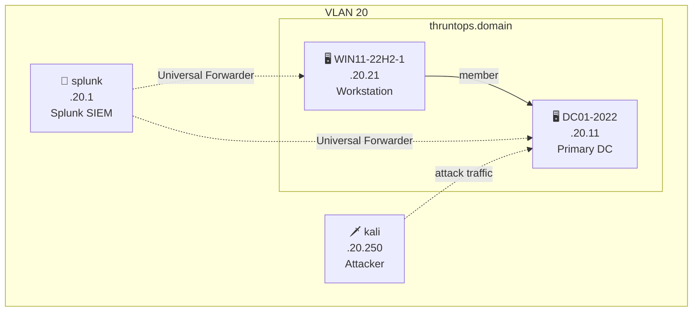

# Splunk Backend
{: .no_toc }

Splunk Enterprise SIEM with a single 2022 AD domain, a Windows 11 workstation, and a Kali attacker VM.
{: .fs-6 .fw-300 }

---

## Table of contents
{: .no_toc .text-delta }

1. TOC
{:toc}

---

## Infrastructure

All VMs run on VLAN 20.

| IP | Hostname | OS | Role |
|---|---|---|---|
| .20.1 | splunk | Ubuntu 24.04 | SIEM — Splunk Enterprise |
| .20.11 | DC01-2022 | Windows Server 2022 | Primary DC — `thruntops.domain` |
| .20.21 | WIN11-22H2-1 | Windows 11 22H2 | Workstation — `thruntops.domain` |
| .20.250 | kali | Kali Linux | Attacker box |

> IP prefix depends on the Ludus range network (e.g. `10.1.0.0/16` → `10.1.20.x`).

---

## Network Diagram


```mermaid
graph TB
    subgraph VLAN20["VLAN 20"]
        subgraph domain["thruntops.domain"]
            DC1["🖥 DC01-2022\n.20.11\nPrimary DC"]
            W1["🖥 WIN11-22H2-1\n.20.21\nWorkstation"]
        end
        SPLUNK["🐧 splunk\n.20.1\nSplunk SIEM"]
        KALI["🗡 kali\n.20.250\nAttacker"]
    end

    W1 -->|"member"| DC1
    SPLUNK -.->|"Universal Forwarder"| DC1
    SPLUNK -.->|"Universal Forwarder"| W1
    KALI -.->|"attack traffic"| DC1
```

---

## Credentials

| Service | URL | User | Password |
|---|---|---|---|
| Splunk Web | `http://<range_ip>.20.1:8000` | `admin` | `thisisapassword` (set in `ranges/splunk-base-2022.yml`) |

Domain and local accounts use Ludus defaults — see [Users](users.md).

---

## Deployment

```bash
./siem.sh deploy splunk   # ranges/splunk-base-2022.yml
```

Or step by step:

```bash
ludus range destroy
ludus range config set -f ranges/splunk-base-2022.yml
ludus range deploy
ludus range logs -f
```

---

## Verify

```bash
./siem.sh check splunk
./siem.sh status splunk
```

Or manually via Splunk Web:

- **Settings → Forwarding and receiving → Forwarder management** — both Windows VMs should appear
- **Search:** `index=windows earliest=-15m` — Windows Event Logs from `DC01-2022` and `WIN11-22H2-1`

Check range status:

```bash
ludus range status
```

---

## Notes

