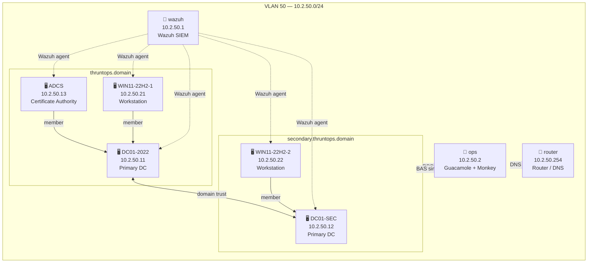

# Wazuh Profile
{: .no_toc }

Lightweight lab with Wazuh all-in-one SIEM, dual AD domains, ADCS, and Breach & Attack Simulation. No web application or GitLab — Wazuh has no Linux agent support in the current role.
{: .fs-6 .fw-300 }

---

## Table of contents
{: .no_toc .text-delta }

1. TOC
{:toc}

---

## Infrastructure

All VMs run on VLAN 50 (`10.2.50.0/24`).

| IP | Hostname | OS | Role |
|---|---|---|---|
| 10.2.50.1 | wazuh | Ubuntu 24.04 | SIEM — Wazuh all-in-one (manager + indexer + dashboard) |
| 10.2.50.2 | ops | Ubuntu 24.04 | Operations — Guacamole + Infection Monkey |
| 10.2.50.11 | DC01-2022 | Windows Server 2022 | Primary DC — `thruntops.domain` |
| 10.2.50.12 | DC01-SEC | Windows Server 2022 | Primary DC — `secondary.thruntops.domain` |
| 10.2.50.13 | ADCS | Windows Server 2022 | Certificate Authority — `thruntops.domain` |
| 10.2.50.21 | WIN11-22H2-1 | Windows 11 22H2 | Workstation — `thruntops.domain` |
| 10.2.50.22 | WIN11-22H2-2 | Windows 11 22H2 | Workstation — `secondary.thruntops.domain` |
| 10.2.50.254 | router | Debian 11 | Router / DNS |

> Kali is not deployed by default. Run `bash scripts/add-kali.sh` to add it at `10.2.50.250`.

---

## Network Diagram



---

## Credentials

| Service | URL | User | Password |
|---|---|---|---|
| Wazuh Dashboard | `https://10.2.50.1` | `admin` | set in `wazuh.yml` → `wazuh_admin_password` |
| Wazuh REST API | `https://10.2.50.1:55000` | `wazuh` | set in `wazuh.yml` → `wazuh_admin_password` |
| Guacamole | `http://10.2.50.2:8080/guacamole/` | `guacadmin` | `guacadmin` |
| Infection Monkey | `https://10.2.50.2:5000` | — | set on first visit |

{: .warning }
The Wazuh REST API user (`wazuh`) is stored in a SQLite database at `/var/ossec/api/configuration/security/rbac.db` and is **not** updated by `wazuh-passwords-tool.sh` (which only changes the OpenSearch `admin` user). If the API password gets out of sync, update it manually using werkzeug's `generate_password_hash` via `/var/ossec/framework/python/bin/python3`.

---

## Deployment

### Install roles

```bash
# Wazuh server (all-in-one)
ludus ansible roles add aleemladha.wazuh_server_install

# Wazuh Windows agent
ludus ansible roles add aleemladha.ludus_wazuh_agent

# ADCS
ludus ansible roles add badsectorlabs.ludus_adcs

# Custom local roles
ludus ansible roles add -d roles/ludus_ad_content
ludus ansible roles add -d roles/ludus_laps
ludus ansible roles add -d roles/ludus_ops
ludus ansible roles add -d roles/ludus_atomic_red_team
```

See the [Installation guide](install.md) for full template and role setup steps.

### Deploy

```bash
ludus range config set -f wazuh.yml
ludus range deploy
```

Monitor:

```bash
ludus range logs -f
```

### Verify

Run the Wazuh agent status check to confirm all agents are enrolled and active:

```bash
bash tests/wazuh_status.sh
```

All Windows VMs (`DC01-2022`, `DC01-SEC`, `ADCS`, `WIN11-22H2-1`, `WIN11-22H2-2`) should appear with status `active`.

---

## Known Limitations

- **No Linux agent**: `aleemladha.ludus_wazuh_agent` only implements Windows tasks. Linux VMs (`ops`) do not ship a Wazuh agent in this profile.
- **Password complexity**: Wazuh indexer requires at least one uppercase, lowercase, digit, and symbol from `.*+?-`. The password in `wazuh_admin_password` must satisfy this requirement.
- **Agent role variable names**: The upstream `aleemladha.ludus_wazuh_agent` role uses non-standard variable names (`wazuh_agent_install_package`, `wazuh_manager_host`) that differ from the `role_vars` keys (`ludus_wazuh_agent_install_package`, `ludus_wazuh_siem_server`). The role must be patched after install — see installation notes.
