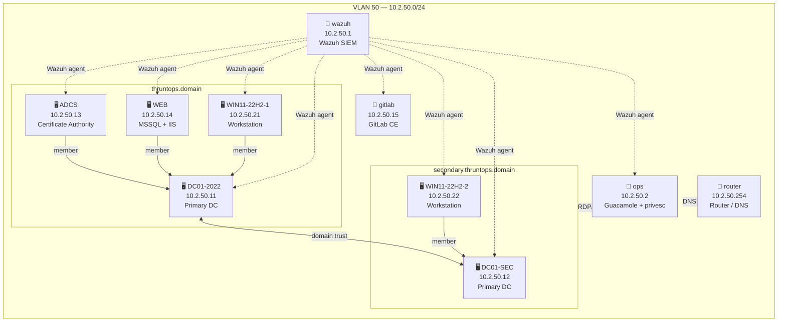

# Wazuh Profile
{: .no_toc }

Full-range lab with Wazuh all-in-one SIEM, dual AD domains, ADCS, workstations, web server, GitLab, and ops. Wazuh agents on all 8 VMs (Windows + Linux).
{: .fs-6 .fw-300 }

---

## Table of contents
{: .no_toc .text-delta }

1. TOC
{:toc}

---

## Infrastructure

All VMs run on VLAN 50 (`10.2.50.0/24`).

| IP | Hostname | OS | Role |
|---|---|---|---|
| 10.2.50.1 | wazuh | Ubuntu 24.04 | SIEM — Wazuh all-in-one (manager + indexer + dashboard) |
| 10.2.50.2 | ops | Ubuntu 24.04 | Operations — Guacamole + sudo privesc scenarios |
| 10.2.50.11 | DC01-2022 | Windows Server 2022 | Primary DC — `thruntops.domain` |
| 10.2.50.12 | DC01-SEC | Windows Server 2022 | Primary DC — `secondary.thruntops.domain` |
| 10.2.50.13 | ADCS | Windows Server 2022 | Certificate Authority — `thruntops.domain` |
| 10.2.50.14 | WEB | Windows Server 2022 | Web — MSSQL 2019 + IIS |
| 10.2.50.15 | gitlab | Ubuntu 24.04 | GitLab CE + SSSD + SUID privesc scenarios |
| 10.2.50.21 | WIN11-22H2-1 | Windows 11 22H2 | Workstation — `thruntops.domain` |
| 10.2.50.22 | WIN11-22H2-2 | Windows 11 22H2 | Workstation — `secondary.thruntops.domain` |
| 10.2.50.254 | router | Debian 11 | Router / DNS |

> Kali is not deployed by default. Run `bash scripts/add-kali.sh` to add it at `10.2.50.250`.

---

## Network Diagram



---

## Credentials

| Service | URL | User | Password |
|---|---|---|---|
| Wazuh Dashboard | `https://10.2.50.1` | `admin` | set in `wazuh.yml` → `wazuh_admin_password` |
| Wazuh REST API | `https://10.2.50.1:55000` | `wazuh` | set in `wazuh.yml` → `wazuh_api_password` |
| Guacamole | `http://10.2.50.2:8080/guacamole/` | `guacadmin` | `guacadmin` |

{: .warning }
The Wazuh REST API user (`wazuh`) and dashboard user (`wazuh-wui`) are stored in a SQLite database at `/var/ossec/api/configuration/security/rbac.db` using werkzeug scrypt hashes. These are **not** updated by `wazuh-passwords-tool.sh` (which only changes the OpenSearch `admin` user). The `ludus_wazuh_server` role handles both via a Python script executed with `/var/ossec/framework/python/bin/python3`.

---

## Deployment

### Install roles

All roles must be registered with Ludus before deploying. Custom local roles require `--force` on re-install to overwrite cached versions.

```bash
# Custom local roles (server + agent)
ludus ansible roles add -d roles/ludus_wazuh_server
ludus ansible roles add -d roles/ludus_wazuh_agent
ludus ansible roles add -d roles/ludus_privesc
ludus ansible roles add -d roles/ludus_ad_content
ludus ansible roles add -d roles/ludus_laps
ludus ansible roles add -d roles/ludus_ops
ludus ansible roles add -d roles/ludus_iis

# Galaxy roles
ludus ansible roles add badsectorlabs.ludus_adcs
ludus ansible roles add badsectorlabs.ludus_mssql
ludus ansible roles add badsectorlabs.ludus_gitlab_ce
ludus ansible roles add badsectorlabs.ludus_gitlab_ldap
ludus ansible roles add badsectorlabs.ludus_sssd
```

{: .note }
After any local role change, re-sync with `ludus ansible roles add -d roles/<name> --force` and verify the installed path with `sudo ls /opt/ludus/users/ludus-admin/.ansible/roles/<name>/tasks/`.

See the [Installation guide](install.md) for full template and role setup steps.

### Deploy

```bash
ludus range config set -f wazuh.yml
ludus range deploy
```

Monitor:

```bash
ludus range logs -f
```

### Verify

Run the Wazuh agent status check to confirm all 8 agents are enrolled and active:

```bash
bash tests/wazuh_status.sh
```

Expected output: all 8 agents (`DC01-2022`, `DC01-SEC`, `WIN11-22H2-1`, `WIN11-22H2-2`, `ADCS`, `WEB`, `gitlab`, `ops`) with status `active`.

---

## Custom Roles

This profile uses two custom Wazuh roles instead of the official `wazuh/wazuh-ansible` collection:

### `ludus_wazuh_server`

Installs Wazuh all-in-one via `wazuh-install.sh -a --ignore-check`. After install:

1. Sets the OpenSearch `admin` password via `wazuh-passwords-tool.sh`
2. Sets the API users (`wazuh`, `wazuh-wui`) via a Python script that writes werkzeug scrypt hashes directly into `/var/ossec/api/configuration/security/rbac.db`
3. Sets the indexer password in the wazuh-manager keystore via `wazuh-keystore -f indexer -k password`
4. Verifies API authentication via `https://localhost:55000/security/user/authenticate`

Key variables (`wazuh.yml` → `role_vars`):

| Variable | Default | Description |
|---|---|---|
| `wazuh_admin_password` | `W4zuh-4dMin!` | OpenSearch admin + keystore password |
| `wazuh_api_password` | `W4zuh-4dMin!` | API `wazuh` and `wazuh-wui` password |

### `ludus_wazuh_agent`

Installs the Wazuh agent on Windows (MSI) and Linux (deb). Idempotent — checks for existing service/binary before downloading.

- **Windows**: downloads MSI from `packages.wazuh.com/4.x/windows/`, installs with `WAZUH_MANAGER` and `WAZUH_REGISTRATION_SERVER` args, configures `ossec.conf` via PowerShell regex replace, starts `WazuhSvc`
- **Linux**: downloads `.deb` from `packages.wazuh.com/4.x/apt/`, installs via `apt`, configures `ossec.conf` via `lineinfile`, enables `wazuh-agent` service

Key variable: `wazuh_manager_ip` (set per-VM in `wazuh.yml` → `role_vars`).

### Why not `wazuh/wazuh-ansible`?

The official collection requires traditional Ansible inventory with host groups (`wazuh_manager`, `wazuh_indexer`, `wazuh_dashboard`, `aio`) and hostvars like `private_ip`. This is incompatible with Ludus's model where each VM executes roles independently in its own play without a shared inventory.

---

## Known Limitations

- **MSSQL install on WEB**: `badsectorlabs.ludus_mssql` occasionally fails with `rc=1` from `setup.exe`. The Wazuh agent on WEB runs first in the role list and installs successfully regardless. Re-deploying resolves the MSSQL failure on subsequent runs.
- **VM ordering matters**: Ludus processes user-defined roles sequentially per VM in config file order. A fatal failure on a VM aborts the playbook for all subsequent VMs. Place Linux VMs (which install quickly) before heavy Windows VMs to ensure agents install even if later roles fail.
- **Role re-sync**: `ludus ansible roles add -d` without `--force` does not overwrite an existing role. Always use `--force` after editing local roles, and verify the installed content with `sudo cat /opt/ludus/users/ludus-admin/.ansible/roles/<name>/tasks/main.yml`.
- **Password complexity**: Wazuh indexer requires passwords with uppercase, lowercase, digit, and symbol from `.*+?-`.
