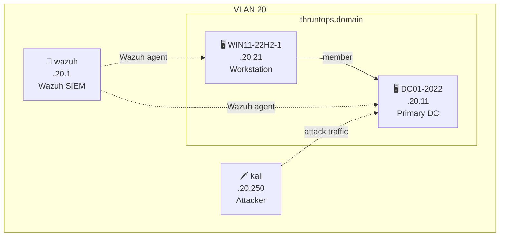

# Wazuh Backend
{: .no_toc }

Wazuh all-in-one SIEM with a single 2022 AD domain, a Windows 11 workstation, and a Kali attacker VM.
{: .fs-6 .fw-300 }

---

## Table of contents
{: .no_toc .text-delta }

1. TOC
{:toc}

---

## Infrastructure

All VMs run on VLAN 20.

| IP | Hostname | OS | Role |
|---|---|---|---|
| .20.1 | wazuh | Ubuntu 24.04 | SIEM — Wazuh all-in-one (manager + indexer + dashboard) |
| .20.11 | DC01-2022 | Windows Server 2022 | Primary DC — `thruntops.domain` |
| .20.21 | WIN11-22H2-1 | Windows 11 22H2 | Workstation — `thruntops.domain` |
| .20.250 | kali | Kali Linux | Attacker box |

> IP prefix depends on the Ludus range network (e.g. `10.1.0.0/16` → `10.1.20.x`).

---

## Network Diagram


```mermaid
graph TB
    subgraph VLAN20["VLAN 20"]
        subgraph domain["thruntops.domain"]
            DC1["🖥 DC01-2022\n.20.11\nPrimary DC"]
            W1["🖥 WIN11-22H2-1\n.20.21\nWorkstation"]
        end
        WAZUH["🐧 wazuh\n.20.1\nWazuh SIEM"]
        KALI["🗡 kali\n.20.250\nAttacker"]
    end

    W1 -->|"member"| DC1
    WAZUH -.->|"Wazuh agent"| DC1
    WAZUH -.->|"Wazuh agent"| W1
    KALI -.->|"attack traffic"| DC1
```

---

## Credentials

| Service | URL | User | Password |
|---|---|---|---|
| Wazuh Dashboard | `https://<range_ip>.20.1` | `wazuh` / `admin` | `Thisisapassword1-` (set in `ranges/wazuh-base-2022.yml`) |

Domain and local accounts use Ludus defaults — see [Users](users.md).

---

## Deployment

```bash
./siem.sh deploy wazuh   # ranges/wazuh-base-2022.yml
```

Or step by step:

```bash
ludus range destroy
ludus range config set -f ranges/wazuh-base-2022.yml
ludus range deploy
ludus range logs -f
```

---

## Verify

```bash
./siem.sh check wazuh
./siem.sh status wazuh
```

Or manually, confirm all agents are active in the Wazuh dashboard:

**Modules → Agents** — both Windows VMs (`DC01-2022`, `WIN11-22H2-1`) should show status `active`.

Check range status:

```bash
ludus range status
```

---

## Notes

- Windows agents include Sysmon telemetry via `ludus_sysmon_windows`
