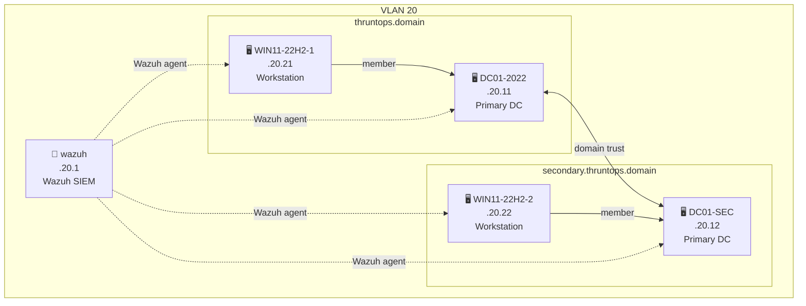

# Wazuh Profile
{: .no_toc }

Wazuh all-in-one SIEM with dual AD domains and workstations. Fase 1 — core infrastructure and agent enrollment.
{: .fs-6 .fw-300 }

Validated on Ludus 2: deploy succeeds, domain authentication works, Wazuh API/dashboard are reachable, and all four agents are active.
{: .label .label-green }

---

## Table of contents
{: .no_toc .text-delta }

1. TOC
{:toc}

---

## Infrastructure

All VMs run on VLAN 20.

| IP | Hostname | OS | Role |
|---|---|---|---|
| .20.1 | wazuh | Ubuntu 24.04 | SIEM — Wazuh all-in-one (manager + indexer + dashboard) |
| .20.11 | DC01-2022 | Windows Server 2022 | Primary DC — `thruntops.domain` |
| .20.12 | DC01-SEC | Windows Server 2022 | Primary DC — `secondary.thruntops.domain` |
| .20.21 | WIN11-22H2-1 | Windows 11 22H2 | Workstation — `thruntops.domain` |
| .20.22 | WIN11-22H2-2 | Windows 11 22H2 | Workstation — `secondary.thruntops.domain` |

> IP prefix depends on the Ludus range network (e.g. `10.1.0.0/16` → `10.1.20.x`).

---

## Network Diagram


```mermaid
graph TB
    subgraph VLAN20["VLAN 20"]

        subgraph primary["thruntops.domain"]
            DC1["🖥 DC01-2022\n.20.11\nPrimary DC"]
            W1["🖥 WIN11-22H2-1\n.20.21\nWorkstation"]
        end

        subgraph secondary["secondary.thruntops.domain"]
            DC2["🖥 DC01-SEC\n.20.12\nPrimary DC"]
            W2["🖥 WIN11-22H2-2\n.20.22\nWorkstation"]
        end

        WAZUH["🐧 wazuh\n.20.1\nWazuh SIEM"]
    end

    DC1 <-->|"domain trust"| DC2
    W1 -->|"member"| DC1
    W2 -->|"member"| DC2

    WAZUH -.->|"Wazuh agent"| DC1
    WAZUH -.->|"Wazuh agent"| DC2
    WAZUH -.->|"Wazuh agent"| W1
    WAZUH -.->|"Wazuh agent"| W2
```

---

## Credentials

| Service | URL | User | Password |
|---|---|---|---|
| Wazuh Dashboard | `https://<range_ip>.20.1` | `admin` | set in `wazuh-core.yml` → `wazuh_admin_password` |
| Wazuh REST API | `https://<range_ip>.20.1:55000` | `wazuh` | set in `wazuh-core.yml` → `wazuh_api_password` |

### Windows — Ludus defaults

| User | Password | Scope |
|---|---|---|
| `localuser` | `password` (template default) | Local Admin — all Windows VMs |
| `THRUNTOPS\domainadmin` | `password` | Domain Admin — thruntops.domain |
| `THRUNTOPS\domainuser` | `password` | Domain User — thruntops.domain |
| `SECONDARY\domainadmin` | `password` | Domain Admin — secondary.thruntops.domain |
| `SECONDARY\domainuser` | `password` | Domain User — secondary.thruntops.domain |

{: .warning }
The Wazuh REST API user (`wazuh`) and dashboard user (`wazuh-wui`) are stored in a SQLite database at `/var/ossec/api/configuration/security/rbac.db` using werkzeug scrypt hashes. These are **not** updated by `wazuh-passwords-tool.sh` (which only changes the OpenSearch `admin` user). The `ludus_wazuh_server` role handles both via a Python script executed with `/var/ossec/framework/python/bin/python3`.

---

## Deployment

```bash
bash deploy.sh wazuh
```

Or step by step:

```bash
ludus range destroy
ludus range config set -f ranges/wazuh-core.yml
ludus range deploy
ludus range logs -f
```

---

## Verify

This profile has passed the post-deploy validation checklist on Ludus 2.

After deploy, confirm all 4 agents are enrolled and active:

```bash
bash tests/wazuh_status.sh
```

Expected output: all agents (`DC01-2022`, `DC01-SEC`, `WIN11-22H2-1`, `WIN11-22H2-2`) with status `active`.

Check range status:

```bash
ludus range status
```

---

## Notes

- `wazuh-core.yml` deploys Wazuh all-in-one via `wazuh-install.sh -a`
- Fase 2 will add ADCS, WEB (IIS + MSSQL), GitLab CE, and OPS VM.
